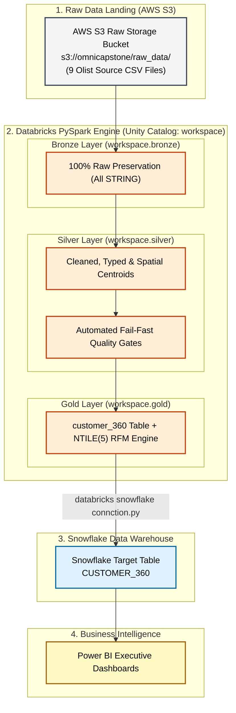

# Customer 360 & RFM Analytics Platform

[-blue?style=for-the-badge&logo=databricks)](docs/data_model.md)
[](https://aws.amazon.com/s3/)
[](https://databricks.com)
[](https://delta.io)
[](https://snowflake.com)
[](https://powerbi.microsoft.com)

An enterprise end-to-end data engineering platform that ingests, cleanses, standardizes, and unifies the **Olist Brazilian E-Commerce dataset** into an analytics-ready **Customer 360 view** enhanced with **RFM (Recency, Frequency, Monetary) customer segmentation**. Built on **AWS S3**, **Databricks PySpark**, **Delta Lake**, **Snowflake**, and **Power BI**.

---

## 1. Project Overview & Business Problem

Retail e-commerce organizations struggle to build a unified view of the customer due to identity fragmentation, spatial data duplication, and data quality drift. This project implements an automated ELT pipeline to solve these challenges using the Medallion Architecture.

### Key Business & Engineering Challenges

1. **Per-Order Customer Identifiers**: Transactional order systems generate a new `customer_id` for every order, masking repeat purchase behavior and obscuring true customer identity.
2. **Duplicate Geolocation Readings**: Raw spatial data contains 1,000,163 GPS readings across 19,015 ZIP prefixes (~50+ readings per prefix). Naive joins multiply order rows and corrupt revenue metrics.
3. **Data Quality & Schema Drift**: Unvalidated payment values, missing timestamps, and inconsistent string casing require strict validation before entering downstream analytical models.

### The Medallion Solution

* **Bronze Layer (`workspace.bronze`)**: Ingests raw source CSV files directly from AWS S3 (`s3://omnicapstone/raw_data/`) verbatim with `inferSchema=false` and all columns preserved as `STRING` (zero data loss).
* **Silver Layer (`workspace.silver`)**: Cleanses strings, casts datatypes, computes spatial ZIP centroids (`AVG(lat)`, `AVG(lng)`), performs deterministic windowed deduplication, and enforces fail-fast data quality gates.
* **Gold Layer (`workspace.gold`)**: Aggregates customer purchase history, computes RFM metrics on delivered orders, applies `NTILE(5)` quintile scoring, assigns marketing segments, and publishes the serving dataset to Snowflake.

---

## 2. System Architecture

### Pipeline Flow Diagram

```
[AWS S3 Raw Storage Bucket] (s3://omnicapstone/raw_data/ — 9 Olist Source CSV Files)
       │
       ▼
[Databricks PySpark Engine — Unity Catalog: workspace]
   ├── BRONZE LAYER (workspace.bronze)   ──►  9 Raw Preservation Tables (All STRING)
   │
   ├── SILVER LAYER (workspace.silver)   ──►  9 Cleaned & Typed Tables (Centroids & Quality Gates)
   │
   └── GOLD LAYER (workspace.gold)       ──►  customer_360 (RFM Segmented)
         │
         ▼  (databricks snowflake connction.py)
[Snowflake Data Warehouse]
   └── CUSTOMER_360                       ──►  Target Analytics Table
         │
         ▼
[Power BI]                                ──►  Executive Dashboards
```



---

## 3. Dataset Summary

The pipeline processes the 9 authentic datasets of the **Olist Brazilian E-Commerce Dataset** landed in AWS S3:

| # | Dataset | Source File | Records | Primary Grain | Key Fields |
|---|---|---|---|---|---|
| 1 | **Customers** | `olist_customers_dataset.csv` | 99,441 | `customer_id` | `customer_id`, `customer_unique_id`, `customer_zip_code_prefix`, `customer_city`, `customer_state` |
| 2 | **Geolocation** | `olist_geolocation_dataset.csv` | 1,000,163 | ZIP Prefix Readings | `geolocation_zip_code_prefix`, `geolocation_lat`, `geolocation_lng`, `geolocation_city`, `geolocation_state` |
| 3 | **Orders** | `olist_orders_dataset.csv` | 99,441 | `order_id` | `order_id`, `customer_id`, `order_status`, `order_purchase_timestamp`, `order_delivered_customer_date` |
| 4 | **Order Payments** | `olist_order_payments_dataset.csv` | 103,886 | (`order_id`, `payment_sequential`) | `order_id`, `payment_sequential`, `payment_type`, `payment_installments`, `payment_value` |
| 5 | **Order Items** | `olist_order_items_dataset.csv` | 112,650 | (`order_id`, `order_item_id`) | `order_id`, `order_item_id`, `product_id`, `seller_id`, `price`, `freight_value` |
| 6 | **Products** | `olist_products_dataset.csv` | 32,951 | `product_id` | `product_id`, `product_category_name`, `product_weight_g`, `product_length_cm`, `product_height_cm` |
| 7 | **Category Translation** | `product_category_name_translation.csv` | 71 | `product_category_name` | `product_category_name`, `product_category_name_english` |
| 8 | **Sellers** | `olist_sellers_dataset.csv` | 3,095 | `seller_id` | `seller_id`, `seller_zip_code_prefix`, `seller_city`, `seller_state` |
| 9 | **Order Reviews** | `olist_order_reviews_dataset.csv` | 99,224 | `review_id` | `review_id`, `order_id`, `review_score`, `review_comment_title`, `review_creation_date` |

> [!NOTE]
> **Data Provenance**: The Gold pipeline (`Gold/01_Gold_Customer_360_CORRECTED.py`) strictly uses these 9 real Olist source files and does not generate or include synthetic order data.

---

## 4. Medallion Layer Implementation Details

### Bronze Layer (`workspace.bronze`)
* **Notebooks**: `Bronze/01_Bronze_Customers.py` through `Bronze/09_Bronze_Geolocation.py`.
* **Behavior**: Preserves exact source structure by reading directly from AWS S3 (`s3://omnicapstone/raw_data/`) (`inferSchema=false`, all columns stored as `STRING`). Zero column renaming, filtering, or null removal.

### Silver Layer (`workspace.silver`)
* **Notebooks**: `Silver/01_Silver_Products.py` through `Silver/09_Silver_Geolocation.py`.
* **Behavior**:
  * **Identity Resolution**: Maps order `customer_id` to human customer key `customer_unique_id`.
  * **Centroid Aggregation**: Groups raw geolocation records by `geolocation_zip_code_prefix` and calculates `AVG(geolocation_lat)` and `AVG(geolocation_lng)` (1,000,163 raw readings $\rightarrow$ 19,015 clean ZIP centroids).
  * **Deterministic Deduplication**: Applies `Window.partitionBy(...).orderBy(...)` with `row_number() == 1` to guarantee deterministic re-runs.
  * **Quality Gates**: Every Silver notebook verifies column presence, row count integrity, and non-null constraints, raising a `ValueError` if a check fails.

### Gold Layer (`workspace.gold`)
* **Notebook**: `Gold/01_Gold_Customer_360_CORRECTED.py`.
* **Behavior**:
  * Filters for `delivered` orders to aggregate metrics on completed transactions.
  * Calculates **Recency** (days since last purchase relative to system reference date), **Frequency** (total delivered orders), **Monetary** (sum of `payment_value` cast to `DECIMAL(18,2)`), and **Average Review Score**.
  * Applies `NTILE(5)` window functions across customer metrics to calculate `r_score` (inverted: lower recency days = higher score), `f_score`, `m_score`, and concatenated `rfm_score`.
  * Left joins Silver Geolocation centroids to attach `latitude` and `longitude`.

---

## 5. RFM Customer Segmentation Rules

Marketing segments are assigned in `Gold/01_Gold_Customer_360_CORRECTED.py` based on `r_score`, `f_score`, and `m_score` rules:

| RFM Segment | Rule Conditions in Code | Segment Meaning |
|---|---|---|
| **Champions** | `r_score >= 4` AND `f_score >= 4` AND `m_score >= 4` | High recency, high frequency, and high monetary value |
| **Loyal Customers** | `r_score >= 3` AND `f_score >= 3` AND `m_score >= 3` | Consistent repeat buyers with solid monetary contribution |
| **Recent Buyers** | `r_score >= 4` AND `f_score <= 2` | Recent purchasers with lower purchase frequency |
| **At Risk / About to Sleep** | `r_score <= 2` AND `f_score >= 3` | Past frequent buyers who have not purchased recently |
| **Churned / Lost** | `r_score <= 2` AND `f_score <= 2` | Low recency and low frequency buyers |
| **Average / Occasional** | *Otherwise* | Baseline customer activity across remaining score combinations |

---

## 6. Technology Stack

| Component | Technology | File / Implementation |
|---|---|---|
| **Cloud Storage** | AWS S3 | S3 Landing Bucket `s3://omnicapstone/raw_data/` (source CSV location in Bronze notebooks) |
| **Compute Engine** | Databricks PySpark | PySpark notebooks in `Bronze/`, `Silver/`, and `Gold/` |
| **Lakehouse Format** | Delta Lake | Unity Catalog tables (`workspace.bronze`, `workspace.silver`, `workspace.gold`) |
| **Data Warehouse Target** | Snowflake | `CUSTOMER_360` table (published via Spark connector) |
| **Publishing Connector** | Snowflake Spark Connector | `databricks snowflake connction.py` (Databricks Secrets `snowflake-secrets` integration) |
| **Analytics & BI** | Power BI | Direct Snowflake connection to `CUSTOMER_360` table |

---

## 7. Repository Structure

```
├── README.md                                   # Project Documentation
├── databricks snowflake connction.py           # Databricks to Snowflake Spark Publishing Script
├── .gitignore                                  # Git exclusion file
│
├── docs/
│   ├── data_model.md                          # Schema definitions & medallion lineage docs
│   ├── ai_usage.md                             # AI tool usage & governance log
│   ├── Architecture.png                        # System architecture diagram image
│   └── HRhd2Y0.png                             # Pipeline execution diagram image
│
├── Bronze/
│   ├── 01_Bronze_Customers.py
│   ├── 02_Bronze_Orders.py
│   ├── 03_Bronze_Order_Items.py
│   ├── 04_Bronze_Products.py
│   ├── 05_Bronze_Category_Translation.py
│   ├── 06_Bronze_Sellers.py
│   ├── 07_Bronze_Payments.py
│   ├── 08_Bronze_Reviews.py
│   └── 09_Bronze_Geolocation.py
│
├── Silver/
│   ├── 01_Silver_Products.py
│   ├── 02_Silver_Sellers.py
│   ├── 03_Silver_Payments.py
│   ├── 04_Silver_Orders.py
│   ├── 05_Silver_Customers.py
│   ├── 06_Silver_Orderitems.py
│   ├── 07_Silver_Category _Translation.py
│   ├── 08_Silver_Reviews.py
│   └── 09_Silver_Geolocation.py
│
├── Gold/
│   └── 01_Gold_Customer_360_CORRECTED.py       # Customer 360 Aggregation & RFM Segmentation
│
└── data/
    └── raw/                                    # Raw Olist CSV source datasets
```

---

## 8. Execution Workflow

### Step 1 — Run Databricks Ingestion (Bronze Layer)
Run all notebooks in `Bronze/` (`01_Bronze_Customers.py` $\rightarrow$ `09_Bronze_Geolocation.py`) to ingest source CSVs into Delta Lake tables in `workspace.bronze`.

### Step 2 — Run Databricks Transformation (Silver Layer)
Run all notebooks in `Silver/` (`01_Silver_Products.py` $\rightarrow$ `09_Silver_Geolocation.py`) to clean, deduplicate, and compute ZIP centroids in `workspace.silver`.

### Step 3 — Run Customer 360 Aggregation (Gold Layer)
Run `Gold/01_Gold_Customer_360_CORRECTED.py` to aggregate delivered order history, compute RFM metrics, assign marketing segments, and produce `workspace.gold.customer_360`.

### Step 4 — Publish Gold Data to Snowflake
Run `databricks snowflake connction.py` in Databricks to publish `workspace.gold.customer_360` to Snowflake table `CUSTOMER_360`.

---

## 9. Key Engineering Standards Enforced

1. **Identity Resolution**: `customer_unique_id` is enforced as the canonical customer entity key across Silver and Gold layers.
2. **Deterministic Deduplication**: Uses `Window.partitionBy(...).orderBy(...)` with `row_number() == 1` to guarantee consistent execution results.
3. **Automated Data Quality Gates**: Every Silver and Gold script contains assertions validating row counts, key uniqueness, schema presence, and non-null bounds.
4. **Bronze Immutability**: Bronze tables preserve source structure verbatim without casting or filtering.
5. **Geographic Centroid Reduction**: Reduces 1,000,163 raw geolocation readings into 19,015 clean ZIP prefix centroids (`AVG(lat)`, `AVG(lng)`), avoiding row multiplication on downstream joins.

---

## 10. Team Members & Documentation

### Team Members
* Asvin Nigam
* Tushar Nag
* Harshraj Parmar
* Preeti Vala

### Project Documentation
* [`docs/data_model.md`](docs/data_model.md) — Schema definitions and Medallion table lineage specifications.
* [`docs/ai_usage.md`](docs/ai_usage.md) — Generative AI tool usage log and human review governance report.