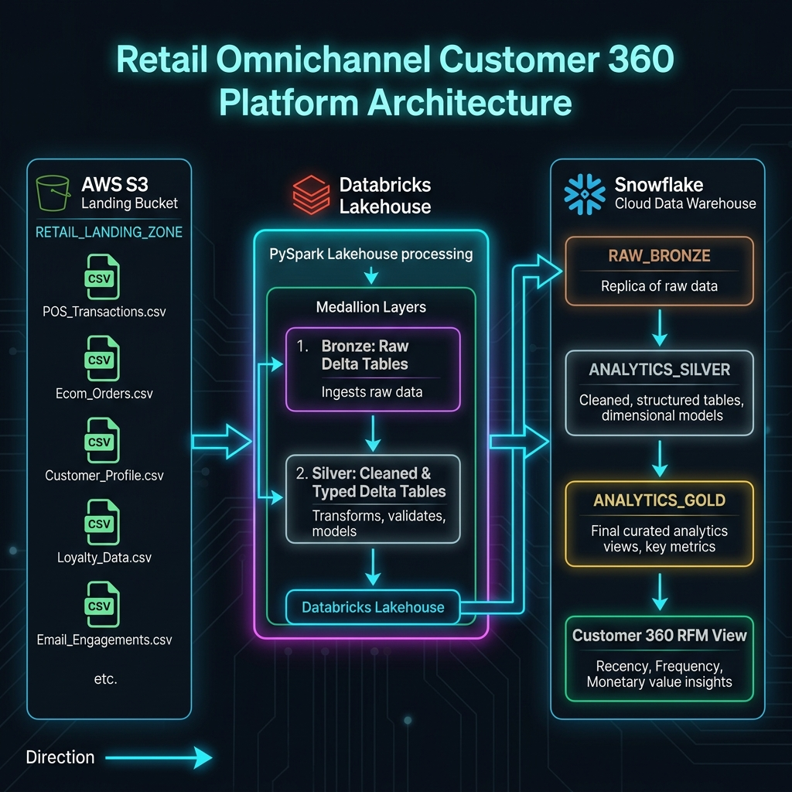
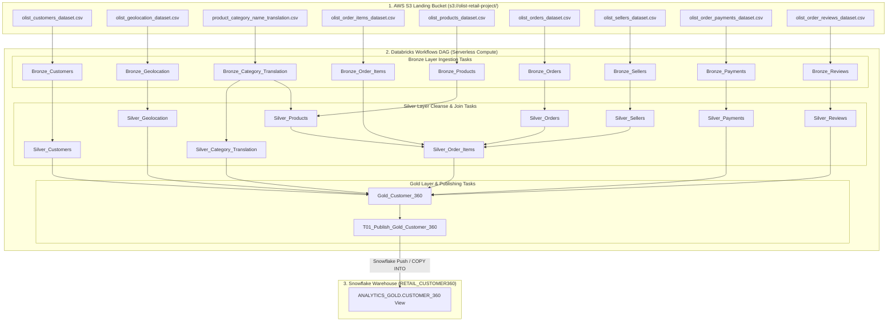

# Enterprise Architecture Diagram & System Specification

**Project**: Omnichannel Customer 360 & RFM Analytics  
**Document**: Deliverable 5 — One-Page Architecture & Databricks Workflow Specification  
**Tech Stack**: AWS S3 | Databricks Workflows (Serverless) | Delta Lake | Snowflake Data Warehouse  

---

## 1. One-Page High-Level Architecture Diagram

---

## 2. Orchestration DAG — Databricks Workflows Execution Topology

The production pipeline is fully automated and orchestrated using **Databricks Workflows** running on **Serverless Compute**. The DAG enforces task dependencies, parallel Bronze ingestion, Silver domain cleansing, Gold customer consolidation, and Snowflake publishing.

---

## 3. Workflow Task Dependency Table

| Task Name | Notebook Path | Cluster Mode | Dependencies | Purpose |
|---|---|---|---|---|
| `Bronze_Customers` | `.../Final_bronze/01_Bronze_Customers` | Serverless | S3 Landing | Raw customer string ingestion |
| `Bronze_Geolocation` | `.../Final_bronze/09_Bronze_Geolocation` | Serverless | S3 Landing | Raw GPS coordinate ingestion |
| `Bronze_Category_Translation` | `.../Final_bronze/05_Bronze_Category_Translation` | Serverless | S3 Landing | Category string mapping ingestion |
| `Bronze_Products` | `.../Final_bronze/04_Bronze_Products` | Serverless | S3 Landing | Product catalog ingestion |
| `Bronze_Orders` | `.../Final_bronze/02_Bronze_Orders` | Serverless | S3 Landing | Order header ingestion |
| `Bronze_Order_Items` | `.../Final_bronze/03_Bronze_Order_Items` | Serverless | S3 Landing | Order items line ingestion |
| `Bronze_Sellers` | `.../Final_bronze/06_Bronze_Sellers` | Serverless | S3 Landing | Seller directory ingestion |
| `Bronze_Payments` | `.../Final_bronze/07_Bronze_Payments` | Serverless | S3 Landing | Order payment ingestion |
| `Bronze_Reviews` | `.../Final_bronze/08_Bronze_Reviews` | Serverless | S3 Landing | Customer review ingestion |
| `Silver_Customers` | `.../final_silver/05_Silver_Customers` | Serverless | `Bronze_Customers` | Windowed `customer_unique_id` dedup |
| `Silver_Geolocation` | `.../final_silver/09_Silver_Geolocation` | Serverless | `Bronze_Geolocation` | Centroid `AVG(lat/lng)` aggregation |
| `Silver_Category_Translation` | `.../final_silver/07_Silver_Category_Translation` | Serverless | `Bronze_Category_Translation` | Category string cleanup |
| `Silver_Products` | `.../final_silver/01_Silver_Products` | Serverless | `Bronze_Products`, `Bronze_Category_Translation` | Left Join English translation |
| `Silver_Orders` | `.../final_silver/04_Silver_Orders` | Serverless | `Bronze_Orders` | Timestamp parsing & quality flags |
| `Silver_Sellers` | `.../final_silver/02_Silver_Sellers` | Serverless | `Bronze_Sellers` | State/city standardization |
| `Silver_Payments` | `.../final_silver/03_Silver_Payments` | Serverless | `Bronze_Payments` | Value casting & invalid payment flags |
| `Silver_Reviews` | `.../final_silver/08_Silver_Reviews` | Serverless | `Bronze_Reviews` | Score range & date parsing |
| `Silver_Order_Items` | `.../final_silver/06_Silver_Orderitems` | Serverless | `Bronze_Order_Items`, `Silver_Orders`, `Silver_Products`, `Silver_Sellers` | Multi-key domain item enrichment |
| `Gold_Customer_360` | `.../01_Gold_Customer_360_CORRECTED` | Serverless | `Silver_Customers`, `Silver_Geolocation`, `Silver_Order_Items`, `Silver_Payments`, `Silver_Reviews`, `Silver_Category_Translation` | Aggregates Customer 360 & RFM Scores |
| `T01_Publish_Gold_Customer360` | `.../01_Publish_Gold_Customer_360` | Serverless | `Gold_Customer_360` | Publishes Gold tables to Snowflake |

---

## 4. Key Architectural Innovations

1. **Serverless Orchestration**: All workflow tasks execute on Databricks Serverless Compute, eliminating cluster startup latency and optimizing cloud compute costs.
2. **Identity Resolution**: Deduplicates transient `customer_id` transactions to permanent `customer_unique_id` human entities using PySpark Window functions (`row_number() == 1`).
3. **Fan-Out Prevention**: Aggregates ~53 coordinate readings per ZIP prefix into single geographic centroids (`AVG(lat)`, `AVG(lng)`), avoiding 53x row multiplication downstream.
4. **Multi-Task Dependency Isolation**: Task-level dependencies prevent `Silver_Order_Items` or `Gold_Customer_360` from executing until all dependent upstream Silver tables successfully complete their quality assertion gates.
