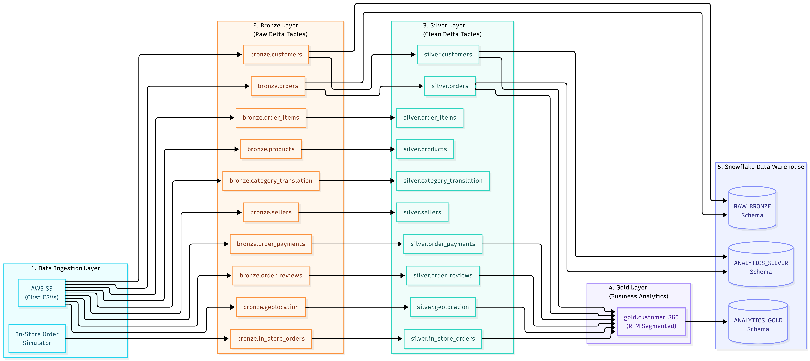
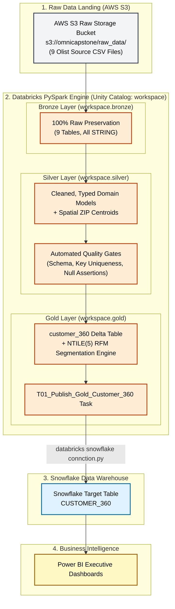
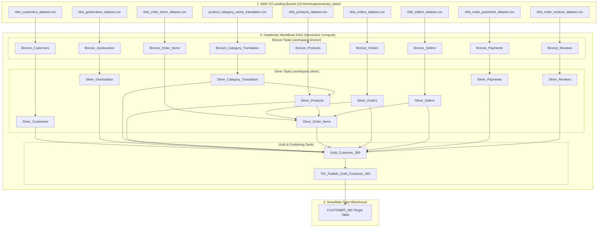
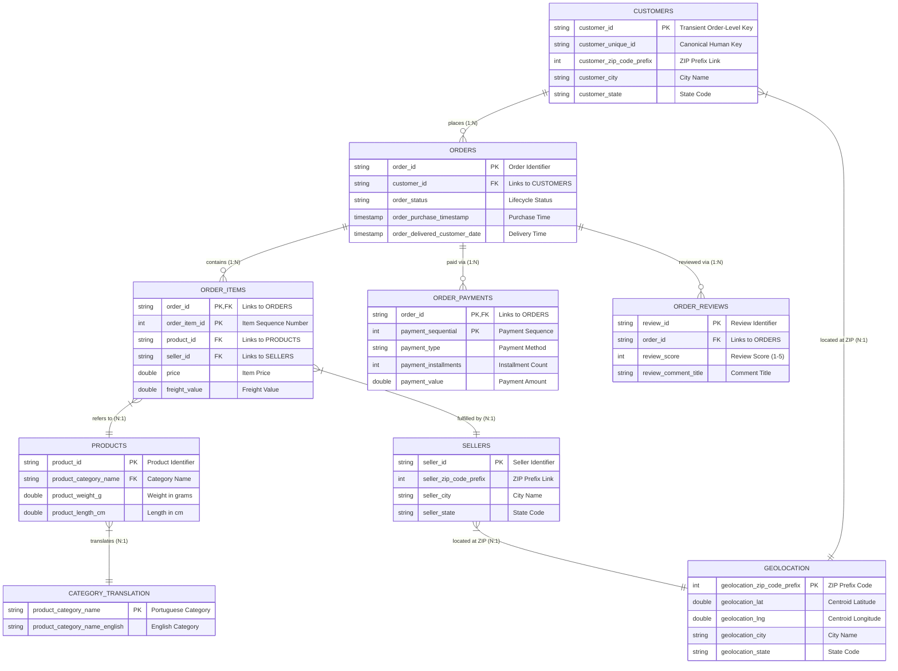

# Data Model Documentation — Retail Customer 360 & Medallion Pipeline

## Overview

This document details the data architecture, entity relationships, schema specifications, identity resolution policies, and transformation logic across the **Bronze**, **Silver**, and **Gold** layers of the Medallion pipeline.

---

## 1. System Architecture & Data Lineage

### High-Contrast Pipeline Flowchart

### Databricks Workflows Execution Topology (Pipeline Flowchart)

---

## 2. Source Entity Relationship Diagram (ERD)

### Interactive Source Entity Relationships (9 Olist Tables)

### Critical Identity Resolution Policy
* `customer_id`: Transient order-level key generated per transaction (99,441 records).
* `customer_unique_id`: Permanent human customer key (~96,096 unique individuals).
* **Engineering Rule**: All Silver and Gold downstream customer analytics use `customer_unique_id` as the canonical customer entity primary key.

---

## 3. Bronze Layer (`workspace.bronze`)

**Policy**: Source Preservation. All columns stored as `STRING`. `inferSchema=false` enforced across all ingestion notebooks to prevent silent schema truncation or type conversion errors.

| Table Name | Source File | Record Count | Primary Key / Grain | Key Schema Columns | Databricks Task |
|---|---|---|---|---|---|
| `workspace.bronze.customers` | `olist_customers_dataset.csv` | 99,441 | `customer_id` | `customer_id`, `customer_unique_id`, `customer_zip_code_prefix`, `customer_city`, `customer_state` | `Bronze_Customers` |
| `workspace.bronze.geolocation` | `olist_geolocation_dataset.csv` | 1,000,163 | ZIP Prefix Readings | `geolocation_zip_code_prefix`, `geolocation_lat`, `geolocation_lng`, `geolocation_city`, `geolocation_state` | `Bronze_Geolocation` |
| `workspace.bronze.orders` | `olist_orders_dataset.csv` | 99,441 | `order_id` | `order_id`, `customer_id`, `order_status`, `order_purchase_timestamp`, `order_delivered_customer_date` | `Bronze_Orders` |
| `workspace.bronze.order_payments` | `olist_order_payments_dataset.csv` | 103,886 | (`order_id`, `payment_sequential`) | `order_id`, `payment_sequential`, `payment_type`, `payment_installments`, `payment_value` | `Bronze_Payments` |
| `workspace.bronze.order_items` | `olist_order_items_dataset.csv` | 112,650 | (`order_id`, `order_item_id`) | `order_id`, `order_item_id`, `product_id`, `seller_id`, `price`, `freight_value` | `Bronze_Order_Items` |
| `workspace.bronze.products` | `olist_products_dataset.csv` | 32,951 | `product_id` | `product_id`, `product_category_name`, `product_weight_g`, `product_length_cm`, `product_height_cm` | `Bronze_Products` |
| `workspace.bronze.category_translation` | `product_category_name_translation.csv` | 71 | `product_category_name` | `product_category_name`, `product_category_name_english` | `Bronze_Category_Translation` |
| `workspace.bronze.sellers` | `olist_sellers_dataset.csv` | 3,095 | `seller_id` | `seller_id`, `seller_zip_code_prefix`, `seller_city`, `seller_state` | `Bronze_Sellers` |
| `workspace.bronze.order_reviews` | `olist_order_reviews_dataset.csv` | 99,224 | `review_id` | `review_id`, `order_id`, `review_score`, `review_comment_title`, `review_creation_date` | `Bronze_Reviews` |

---

## 4. Silver Layer (`workspace.silver`)

**Policy**: Cleaned, Typed, Deduplicated Domain Models with Automated Data Quality Gates.

### 4.1 `silver.customers` (`Silver_Customers` Task)
* **Grain**: 1 Row per `customer_unique_id` (~96,096 rows).
* **Upstream Task Dependency**: `Bronze_Customers`
* **Deduplication Strategy**: PySpark Window function `partitionBy("customer_unique_id").orderBy("customer_id")` filtering `row_number() == 1`.
* **Attributes**: `customer_unique_id` (STRING), `customer_id` (STRING), `customer_zip_code_prefix` (INT), `customer_city` (STRING, trimmed & lowercased), `customer_state` (STRING, trimmed & uppercased), `silver_load_timestamp` (TIMESTAMP).

### 4.2 `silver.geolocation` (`Silver_Geolocation` Task)
* **Grain**: 1 Row per `geolocation_zip_code_prefix` (19,015 clean spatial centroids).
* **Upstream Task Dependency**: `Bronze_Geolocation`
* **Aggregation Strategy**: `groupBy("geolocation_zip_code_prefix")` calculating spatial centroids `AVG(geolocation_lat)` and `AVG(geolocation_lng)`.
* **Attributes**: `geolocation_zip_code_prefix` (INT), `geolocation_lat` (DOUBLE), `geolocation_lng` (DOUBLE), `geolocation_city` (STRING), `geolocation_state` (STRING), `silver_load_timestamp` (TIMESTAMP).

### 4.3 `silver.orders` (`Silver_Orders` Task)
* **Grain**: 1 Row per `order_id` (99,441 rows).
* **Upstream Task Dependency**: `Bronze_Orders`
* **Attributes**: `order_id` (STRING), `customer_id` (STRING), `order_status` (STRING), `order_purchase_timestamp` (TIMESTAMP), `order_approved_at` (TIMESTAMP), `order_delivered_carrier_date` (TIMESTAMP), `order_delivered_customer_date` (TIMESTAMP), `order_estimated_delivery_date` (TIMESTAMP), `silver_load_timestamp` (TIMESTAMP).

### 4.4 `silver.order_payments` (`Silver_Payments` Task)
* **Grain**: 1 Row per `order_id` + `payment_sequential` (103,886 rows).
* **Upstream Task Dependency**: `Bronze_Payments`
* **Attributes**: `order_id` (STRING), `payment_sequential` (INT), `payment_type` (STRING), `payment_installments` (INT), `payment_value` (DOUBLE), `silver_load_timestamp` (TIMESTAMP).

### 4.5 `silver.order_items` (`Silver_Order_Items` Task)
* **Grain**: 1 Row per `order_id` + `order_item_id` (112,650 rows).
* **Upstream Task Dependencies**: `Bronze_Order_Items`, `Silver_Orders`, `Silver_Products`, `Silver_Sellers`
* **Attributes**: `order_id` (STRING), `order_item_id` (INT), `product_id` (STRING), `seller_id` (STRING), `shipping_limit_date` (TIMESTAMP), `price` (DOUBLE), `freight_value` (DOUBLE), `silver_load_timestamp` (TIMESTAMP).

### 4.6 `silver.products` (`Silver_Products` Task)
* **Grain**: 1 Row per `product_id` (32,951 rows).
* **Upstream Task Dependencies**: `Bronze_Products`, `Silver_Category_Translation`
* **Enrichment**: Left joined with `category_translation` to attach `product_category_name_english`.
* **Attributes**: `product_id` (STRING), `product_category_name` (STRING), `product_category_name_english` (STRING), `product_weight_g` (DOUBLE), `product_length_cm` (DOUBLE), `product_height_cm` (DOUBLE), `product_width_cm` (DOUBLE), `silver_load_timestamp` (TIMESTAMP).

### 4.7 `silver.sellers` (`Silver_Sellers` Task)
* **Grain**: 1 Row per `seller_id` (3,095 rows).
* **Upstream Task Dependency**: `Bronze_Sellers`
* **Attributes**: `seller_id` (STRING), `seller_zip_code_prefix` (INT), `seller_city` (STRING), `seller_state` (STRING), `silver_load_timestamp` (TIMESTAMP).

### 4.8 `silver.order_reviews` (`Silver_Reviews` Task)
* **Grain**: 1 Row per `review_id` (99,224 rows).
* **Upstream Task Dependency**: `Bronze_Reviews`
* **Attributes**: `review_id` (STRING), `order_id` (STRING), `review_score` (INT), `review_comment_title` (STRING), `review_comment_message` (STRING), `review_creation_date` (TIMESTAMP), `review_answer_timestamp` (TIMESTAMP), `silver_load_timestamp` (TIMESTAMP).

### 4.9 `silver.category_translation` (`Silver_Category_Translation` Task)
* **Grain**: 1 Row per `product_category_name` (71 rows).
* **Upstream Task Dependency**: `Bronze_Category_Translation`
* **Attributes**: `product_category_name` (STRING), `product_category_name_english` (STRING), `silver_load_timestamp` (TIMESTAMP).

---

## 5. Gold Layer Schema (`workspace.gold.customer_360`)

### Table: `workspace.gold.customer_360` / `CUSTOMER_360`

* **Target Path**: `workspace.gold.customer_360` (Databricks Delta Lake) $\rightarrow$ Snowflake `CUSTOMER_360`
* **Upstream Task Dependency**: All 9 Silver tasks (`Silver_Customers`, `Silver_Geolocation`, `Silver_Category_Translation`, `Silver_Products`, `Silver_Order_Items`, `Silver_Orders`, `Silver_Sellers`, `Silver_Payments`, `Silver_Reviews`)
* **Downstream Workflow Task**: `T01_Publish_Gold_Customer_360` (`...360/01_Publish_Gold_Customer_360`)
* **Grain**: 1 Row per `customer_unique_id`
* **Filter Rule**: Computed strictly on orders with `order_status = 'delivered'`.

| Column Name | Data Type | Key / Constraint | Derivation Formula & Business Description |
|---|---|---|---|
| `customer_unique_id` | STRING / VARCHAR(50) | **PK** | Canonical permanent human customer entity key |
| `customer_city` | STRING / VARCHAR(100) | Attribute | Standardized city from Silver Customers |
| `customer_state` | STRING / VARCHAR(5) | Attribute | Standardized 2-letter state code from Silver Customers |
| `customer_zip_code_prefix` | INT | Attribute | Customer ZIP prefix code |
| `latitude` | DOUBLE / FLOAT | Spatial | Geographic centroid latitude from Silver Geolocation |
| `longitude` | DOUBLE / FLOAT | Spatial | Geographic centroid longitude from Silver Geolocation |
| `recency_days` | INT | Metric ($R$) | `DATEDIFF(analysis_date, MIN(order_purchase_timestamp))` |
| `frequency` | LONG / INT | Metric ($F$) | `COUNT(order_id)` across completed (`delivered`) orders |
| `monetary` | DECIMAL(18,2) | Metric ($M$) | `SUM(payment_value)` across completed (`delivered`) orders |
| `avg_review_score` | DOUBLE / FLOAT | Metric | `AVG(review_score)` across customer's reviews |
| `r_score` | INT | Quintile (1-5) | `6 - NTILE(5) OVER (ORDER BY recency_days ASC, customer_unique_id ASC)` |
| `f_score` | INT | Quintile (1-5) | `NTILE(5) OVER (ORDER BY frequency ASC, customer_unique_id ASC)` |
| `m_score` | INT | Quintile (1-5) | `NTILE(5) OVER (ORDER BY monetary ASC, customer_unique_id ASC)` |
| `rfm_score` | STRING / VARCHAR(3) | Attribute | `CONCAT(r_score, f_score, m_score)` (e.g. `'555'`, `'111'`) |
| `rfm_segment` | STRING / VARCHAR(50) | Segment | Assigned segment name based on score rule matrix below |
| `gold_load_timestamp` | TIMESTAMP | Audit | Load execution timestamp (`current_timestamp()`) |

---

## 6. RFM Marketing Segmentation Rules

Segment assignment is executed in `Gold/01_Gold_Customer_360_CORRECTED.py` using PySpark conditional branching:

| RFM Segment | PySpark `when` Condition | Business Segment Definition |
|---|---|---|
| **Champions** | `r_score >= 4 AND f_score >= 4 AND m_score >= 4` | Purchased recently, buy frequently, and generate top revenue |
| **Loyal Customers** | `r_score >= 3 AND f_score >= 3 AND m_score >= 3` | Consistent repeat purchasers with high monetary contribution |
| **Recent Buyers** | `r_score >= 4 AND f_score <= 2` | Purchased recently but low overall order frequency |
| **At Risk / About to Sleep** | `r_score <= 2 AND f_score >= 3` | Past frequent buyers who have not ordered recently |
| **Churned / Lost** | `r_score <= 2 AND f_score <= 2` | Low recency, frequency, and monetary scores |
| **Average / Occasional** | *Otherwise* | Baseline customer activity across remaining score permutations |

---

## 7. Data Quality Gates & Validation Principles

1. **Identity Integrity**: Checks that 100% of order `customer_id` records map cleanly to a valid `customer_unique_id` without fan-out.
2. **Order Grain Assertion**: Asserts that preparing payments (`SUM(payment_value)`) and reviews (`AVG(review_score)`) preserves exactly one row per `order_id`.
3. **Spatial Deduplication**: Ensures `silver.geolocation` has zero duplicate ZIP prefixes before joining to prevent row multiplication.
4. **Range & Null Assertions**: Fails the run (`ValueError`) if `r_score`, `f_score`, or `m_score` fall outside 1–5, or if `rfm_segment` contains null values.